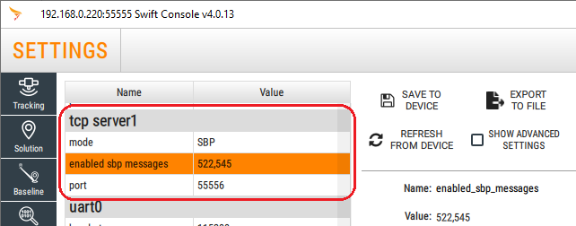

Sora Device Client
=================

The Sora Device Client provides a set of tools to connect your GNSS device to [Sora](https://support.swiftnav.com/support/solutions/articles/44002416509-introduction-to-sora).

The Sora Device Client consists of:

 - A command-line client - the simplest way to connect to Sora
 - A Python client library - for deeper integration and customization

# Table of Contents

<!-- vim-markdown-toc GFM -->

* [Installing](#installing)
  * [Dependencies](#dependencies)
    * [Package Manger](#package-manger)
    * [Buf](#buf)
    * [Python Interpreter](#python-interpreter)
    * [Python Dependencies](#python-dependencies)
* [Command-Line Client](#command-line-client)
  * [Configuration file](#configuration-file)
  * [Running](#running)
    * [Login](#login)
    * [Start](#start)
    * [Logout](#logout)
  * [Data file](#data-file)
* [GNSS Receiver Configuration](#gnss-receiver-configuration)
* [Technical Support](#technical-support)

<!-- vim-markdown-toc -->

# Installing

## Dependencies

You should only need to follow these steps once per machine you are setting up to run the sora-device-client on.

### Package Manger
You will most likely need a package manager to install the other dependencies. Use the one that is canonical for your distribution, for example: `apt`, `dnf`, `yum`, `pacman`.

For macOS, it is recommend to use [homebrew](https://brew.sh/). For windows, something like [chocolately](https://chocolatey.org/) will do.

### Python Interpreter
You need to install Python. Versions 3.8 - 3.11 are supported. See <https://www.python.org/downloads/> for download instructions.
On macOS, you can use homebrew as well:
```bash
brew install python@3.10
```

## Install with `pip` from PyPI.

`pip install sora-device-client`

## Install a development version.

See DEVELOPMENT.md for info on installing from source / CI build.

# Command-Line Client

## Configuration file
Copy the default config file to the appropriate location. `sora` will tell you where it should go:

```sh
sora paths
# Example output:
# Configuration folder: (your config.toml needs to go in here)
#     /home/jwhitaker/.config/sora-device-client
#
# Data folder: (other runtime data gets stored in here)
#     /home/jwhitaker/.local/share/sora-device-client
```

`sora` will also give you an example configuration:
```sh
sora example-config
# ==============================================================================
# Sora Device Client configuration
# ==============================================================================
#
# ...
#
```

Putting them together, you can set up a config file in the right location, and edit it:

```sh
mkdir -p /home/jwhitaker/.config/sora-device-client/ # (configuration folder from `sora paths`)
sora example-config > /home/jwhitaker/.config/sora-device-client/config.toml
notepad /home/jwhitaker/.config/sora-device-client/config.toml # or whatever
```

You will most likely have to edit the `[location.driver]` section to work with the location source for your system.

If you are connecting to a GNSS location source over the network, it will be something like:
```toml
[location.driver.tcp]
host = "localhost"
port = 55555
```
However if you are connecting over a serial or USB port:
```toml
[location.driver.serial]
port = "/dev/tty.usbmodem14401"
baud = 115200
```
The value of `port` will be highly hardware specific. Some values that are known to have worked are: `/dev/ttyACM0`, `/dev/ttyUSB0`, `/dev/tty.usbmodem14401`.
If you have Swift hardware and have installed the Swift Console: https://support.swiftnav.com/support/solutions/articles/44001903699-installing-swift-console, the value used to connect it to your swift device will work.

Also note that sometimes non privileged users do not have permission to read and write to the device. The easiest way to obtain these permissions is to add your user to the group of the device. For example if it is `/dev/ttyACM0`, the group to add yourself to may be obtained with:
```bash
stat -c "%G" /dev/ttyACM0
```
See [here](https://wiki.archlinux.org/title/users_and_groups#Other_examples_of_user_management) for how to add a user to a group on Linux. You may need to log out of and log in to the operating system session again. On macOS and Windows, the instructions are too varied to list here. Please research how to do this for your combination of OS and OS version.

The Sora Device Client, by default, does not transmit device orientation data. However, if this flag is enabled, the client will only send the device state after receiving the `ORIENT EULER` message. It is important to note that this message is exclusively available in products with inertial fusion enabled. As such, please only enable this feature if it is required for your specific use case.
```toml
[location.format.sbp]
orientation = false
```

## Running

```
Once installed, the `sora` command will be in the path:
```bash
sora --help
```

### Login
To authenticate with a sora server, run
```bash
sora login
```
and follow the interactive procedure. You will need access to a web browser.

### Start
After authentication, you can stream data to the sora server with
```bash
sora --verbose start
```

### Logout
If you wish to use a difference set of credentials on the same hardware, you can clear them with
```bash
sora logout
```

## Data file
There is also a data file called `data.toml` that is used to store data that is generated by `sora login`. Typically, running `sora logout` will clear this file.
If you need to manually remove it, its location is is the `Data path` location from the output of

```sh
sora paths
```

# GNSS Receiver Configuration

The Sora Device Client works with Swift Navigation receivers and Starling Position Engine software using data in SBP protocol. Refer to the receiver-specific manual to configure your receiver:

- [Piksi Multi](https://support.swiftnav.com/support/solutions/folders/44001200455)
- [Duro](https://support.swiftnav.com/support/solutions/folders/44001200456)
- [PGM EVK](https://support.swiftnav.com/support/solutions/articles/44002129828-pgm-evaluation-kit)
- [Starling Positioning Engine](https://support.swiftnav.com/support/solutions/folders/44001223202)

The device client uses the following SBP messages:

| Message Name | Message ID (decimal) | Description |
| :--- | :---: | :--- |
| `POS LLH` | 522 | Position (latitude, longitude, altitude) |
| `ORIENT EULER` | 545 | Orientation (roll, pitch, yaw)<br>*Using this message is optional*<br>*Message is available only in products with inertial fusion enabled* |

Download [Swift Binary Protocol Specification](https://support.swiftnav.com/support/solutions/articles/44001850782-swift-binary-protocol)


### Piksi Multi / Duro Configuration Example

Piksi Multi and Duro configuration can be changed using [Swift Console](https://support.swiftnav.com/support/solutions/articles/44001391679-swift-console) program. `TCP Server 1` settings example:



*Note: Click SAVE TO DEVICE button to memorize settings over the power cycle.*


### Starling Configuration Example
  
Starling configuration is saved in the yaml configuration file. `TCP server` output example:
  ```
  ...
    outputs:
      - name: sbp-sora
        protocol: sbp
        type: tcp-server
        port: 55556
        max-conns: 4
        sbp:
          enabled-messages: [ 522,545 ]
  ...
  ```


# Technical Support

Support requests can be made by filling the Support Request Form on the [Swift Navigation Support page](https://support.swiftnav.com/) (Support Request Form button is at the bottom of the page). A simple login is required to confirm your email address.
